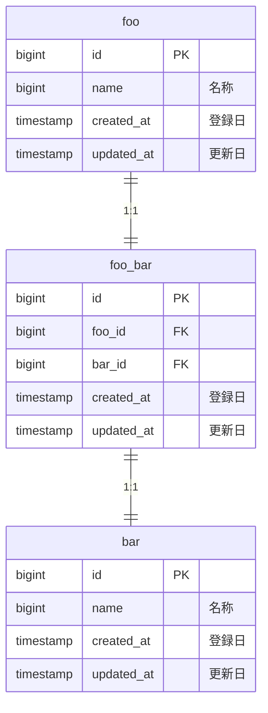
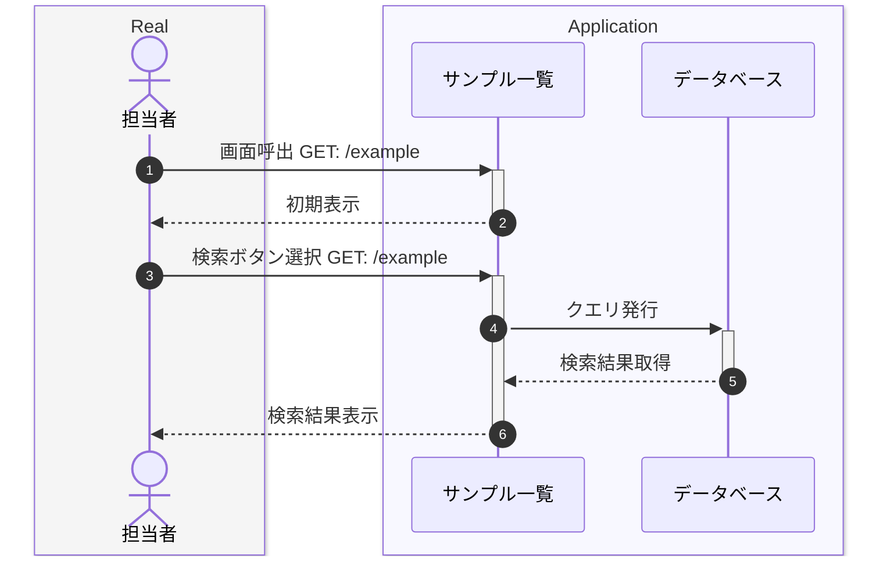

# example 機能設計書

## UI イメージ

### 初期表示後

```
モック完成後にスクリーンショットを貼り付け
Figma のリンクでもOK
```

### 検索後

```
モック完成後にスクリーンショットを貼り付け
Figma のリンクでもOK
```

## 画面項目定義

### ヘッダ表示部

| #   | 項目名 | DB 項目 | 旧 DB 項目 |
| --- | ------ | ------- | ---------- |
| 1   | aaa    | bbb     |            |

### 一覧表示部

| #   | 項目名 | DB 項目 | 旧 DB 項目 |
| --- | ------ | ------- | ---------- |
| 1   | aaa    | bbb     |            |

## イベント定義

| #   | イベント名                    | ルーティング |
| --- | ----------------------------- | ------------ |
| 1   | [初期表示](#初期表示検索処理) | index        |
| 2   | [検索](#初期表示検索処理)     | index        |

## バリデーション定義

| #   | イベント | 項目 | バリデーション種別 |
| --- | -------- | ---- | ------------------ |
| 1   | 登録     | Foo  | Required           |

## メッセージ定義

| #   | イベント | 表示条件           | メッセージ内容     |
| --- | -------- | ------------------ | ------------------ |
| 1   | 検索     | 検索結果が０件の時 | データがありません |

## イベント詳細仕様

### 初期表示/検索処理

#### 仕様

初期表示時および検索ボタン選択時にデータベースからデータ取得・表示する

#### ER 図



#### 処理フロー


